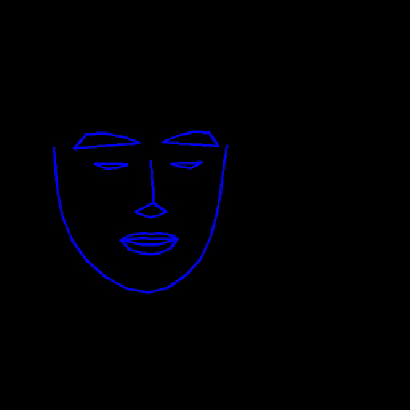

# lsp
recreating the LSP(LiveSpeechPortraits) alg.

## test config 
```
python test_config.py
```

## data preprocess
training data structure:
```
data
-- video_name
  -- APC  # the featrure get(infer) from the given apc model.
    --xx_APC_feature_xxx.npy
  --checkpoints
  --imgs  # all preprocessed img from your video.
  --candidates  # random 4 img from imgs
  --g_sample # generator model's tranining img for test(eye) the g_model
  --label # some 3d trainning data act as label from 3d tracking(reconstruct) alg, here is deca.
    --3d_fit_data.npz
    --mean_pts_3d.npy
    --...
  --video_audio  # your video(mp4) and audio file(wav).
```

```
python video_preprocess.py
1. video preprocess
    1. change fps to 60
    2. crop video to (512, 512)
    3. translate video to images
    4. extract audio from croped video
    5. merge audio, images, or video to new video.
2. translated imgs
    1. using deca to extract useful information 
    2. cd otherlib/deca
    sh run.sh
      2.1. before you run sh run.sh , you should pip install -r requriments.txt
      2.2 you can choose another conda env, or you can change the package version from requriments.txt 
      2.3 you can change the parameters in run.sh
      2.4 diff name, you may change the lambda func in datasets.py


```
## train
change the paramertes of yaml config file:
task, task_block and some other parameters from model and some basic traning paramertes: max_epochs, log_steps, checkpoint_steps, n_epochs
```
python train.py
```

# infer
change the config as in train,
infer_a(audio), infer_h(headpose), infer_g(generator), infer_file_x, test_audio
```
python demo.py
```

## test
1. test config
2. test generator
3. test from test_mode(xx.yaml config from traing config), there are many combination
```
3. python demo.py
2. cd test_scripts
python test_xx.py
```

## gallery



## improve
1. audio2landmark, data process, like landmarks aligement you can try:
[noise_resilient_3dtface](https://github.com/eeskimez/noise_resilient_3dtface) or others
2. change other 3d face reconstruction alg.
3. [new preprocess may you can reference](https://deepimagination.cc/SPACEx/)

## portrait rights
the result video only for academic test, the original resource comes from bilibili. 
